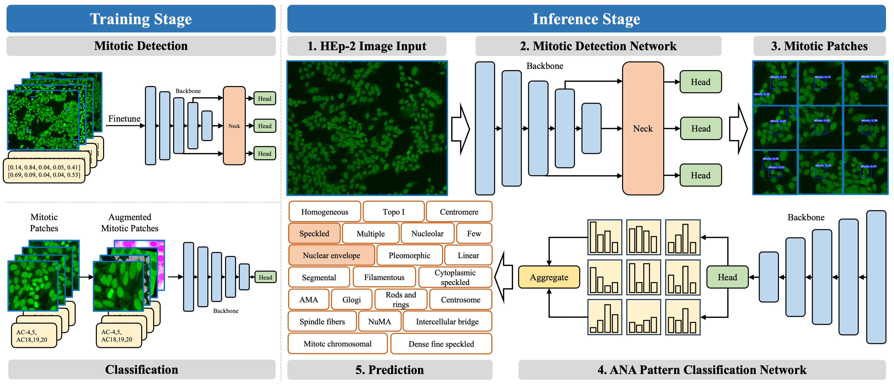

# FM-ANA
Official implementations of fine-grained and multi-pattern ANA recognition.



## Requirements

We recommend using Anaconda environment and installing required dependencies via

```shell
conda create -n anahep2 python=3.10
pip install -r requirements.txt
```

## Data access

All the data and pretrained models can be obtrained in the following Baidu cloud disk:
Link: https://pan.baidu.com/s/1uyEX_4-Vmoxa9r17Knj0Rg?pwd=8s9w code: 8s9w 

## Training

### Mitotic cell detection

Please follow the [original implementation of YOLOv5](https://github.com/ultralytics/yolov5) to train the mitotic cell detector. After training and prediction, run the `crop.py` to process the original high-resolution images into mitotic-centric patches.

### Classification

The script `train.py` enables training and evaluation. Our experiment can be reproduced on a two GPU machine by runing the following command:

```shell
torchrun --nproc_per_node 2 train.py -d /path/to/crops --label_file /path/to/splits.json -n experiment_name
```

## LICENSE

This codebase is released under GNU General Public License.
